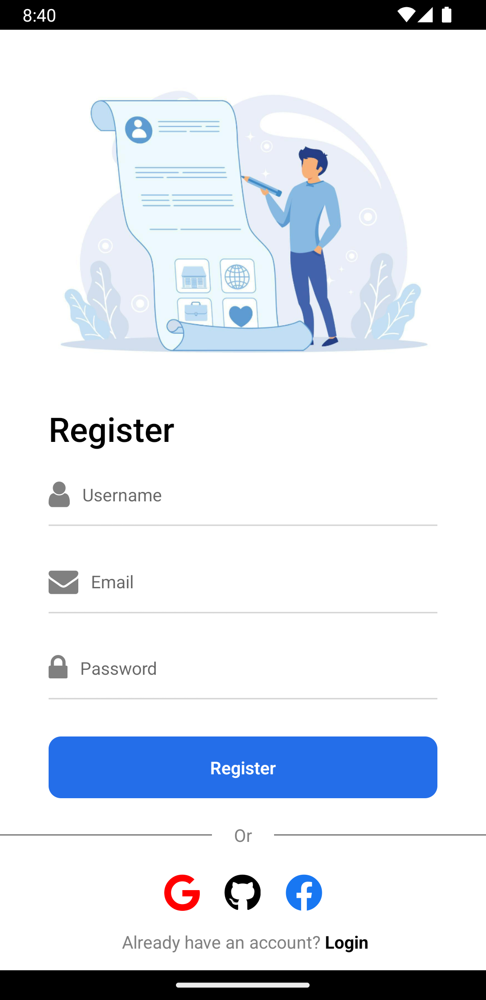

This is a React Native application that lists popular movies using the TMDB API. Authentication is implemented using Firebase, and Redux is used for state management.

| onboarding 1       | onboarding 2           | onboarding 3  |
| ------------- |:-------------:| -----:|
|  </img>      |  </img> | </img> |

| Login        | Register           | Home  |
| ------------- |:-------------:| -----:|
|  </img>      |  </img> | </img> |

| Details        | Search           | 
| ------------- |:-------------:|
|  </img>      |  </img> |

